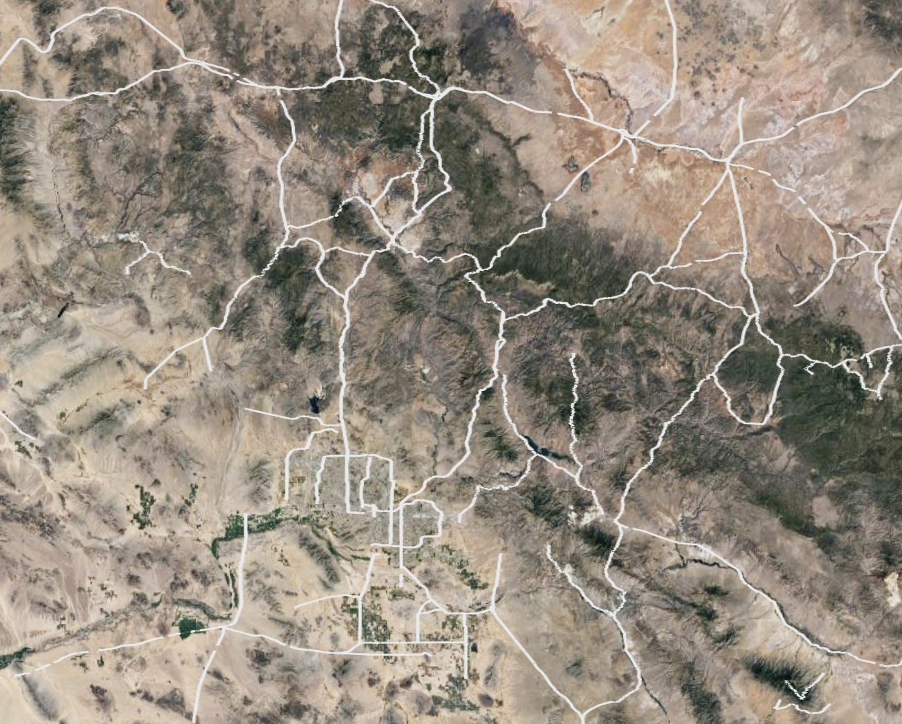

# OSM-Route-Extractor
This is a tool that extracts the coordinates of roads from [Open Street Map](https://www.openstreetmap.org) data.  
This data is most easily accessable in osm.pbf formats. Example files can be found [here](http://download.openstreetmap.fr) and [here](http://download.geofabrik.de/north-america/us/)

The Open Street Map data model consists of three core elements:
1. Nodes
2. Ways
3. Relations

The nodes are points on the Earth that always have a latitude and longitude
Ways are ordered list of nodes, and relations are some type of relationship between one or more nodes, ways, and/or relations. 

This script filters the roads out of all the relations, identifies the ways that the road consists of, and joins the ways together. The joining of ways becomes complicated because some ways are ordered in the opposite direction compared to other ways in the road.
The final output is a csv file where each line is a list of ordered (longitude, latitude) points that make up a road.

Because there can be a significant amount of unused nodes, a low memory overhead method is also available. Larger osm.pbf files (>200mb) can take up large amounts of memory with the normal method, so the low memory overhead method can be used. However, this method is far slower than the normal method. 

There is also a secondary script to create a KML that allows visualization of the extracted roads. 

## Requirements
[osmium](https://pypi.org/project/osmium/) `pip install osmium`  
[simplekml](https://pypi.org/project/simplekml/) `pip install simplekml`

## Example Usage

Extracting roads to csv from osm.pbf:

`osmRouteExtractor % python osmProcessor.py -f san_bernardino.osm.pbf hold.csv`

The `-f` flag forces joins between the ways in a road even if they do not perfectly match up.

The `-lm` flag enables the low memory overhead method.

The `-l` flag sets the logging level. 

Note that processing large osm.pbf files can take a few minutes

Creating KML from csv:

`osmRouteExtractor % python generateKML.py -n 100 hold.csv test.kml`

The `-f` flag enables filtering to remove poorly mapped roads with nodes far apart.

The `-n` flag sets the number of roads to output into the KML. Large numbers of roads will crash Google Earth when attempting to open the KML.

An example output KML looks something like this:

## TODO
* Rewrite the distance measurement function - it currently is mathematically unsound
  